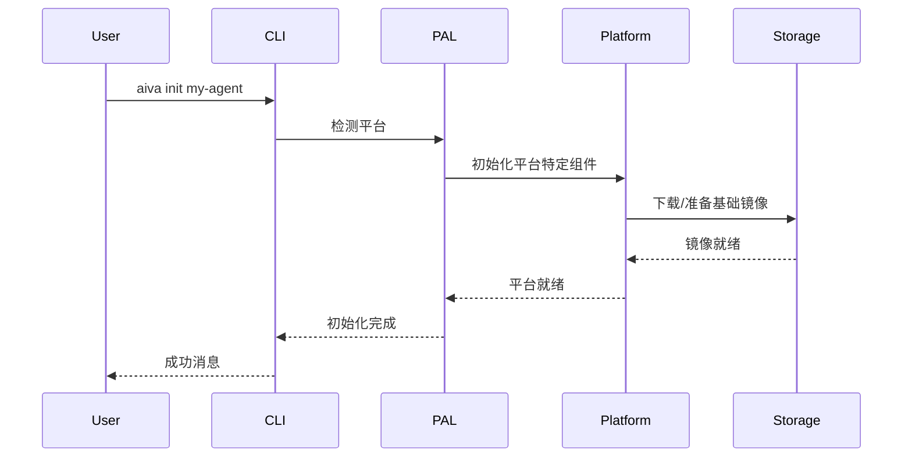
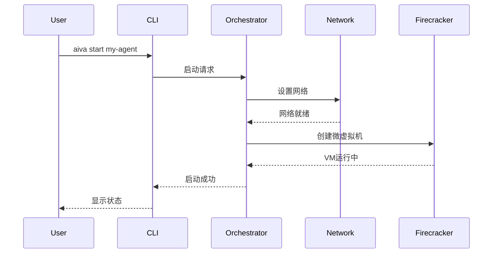
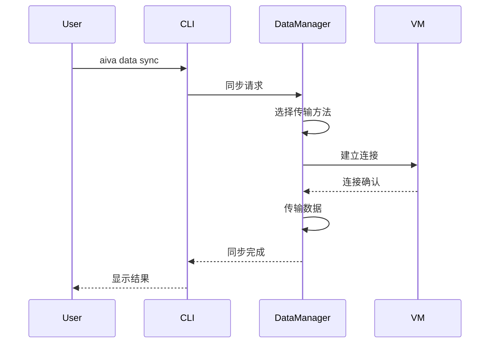

# AI代理和MCP服务器本地微虚拟机环境 - 系统设计

## 1. 系统架构概述

### 1.1 整体架构

本系统采用分层架构设计，从上至下包括：

```
┌─────────────────────────────────────┐
│         用户接口层 (CLI)            │
├─────────────────────────────────────┤
│       编排与管理层                  │
├─────────────────────────────────────┤
│     平台抽象层 (PAL)               │
├─────────────────────────────────────┤
│   虚拟化层 (Firecracker/Lima/WSL2) │
├─────────────────────────────────────┤
│     宿主操作系统                    │
└─────────────────────────────────────┘
```

### 1.2 核心组件

#### 1.2.1 CLI工具 (`aiva`)

- **职责**：提供统一的用户交互接口
- **技术选型**：Rust（性能、跨平台、内存安全）
- **主要模块**：
  - 命令解析器
  - 配置管理器
  - 日志系统
  - 错误处理器

#### 1.2.2 编排管理器

- **职责**：管理微虚拟机生命周期和资源分配
- **主要功能**：
  - VM实例管理
  - 资源调度
  - 状态监控
  - 数据持久化

#### 1.2.3 平台抽象层 (PAL)

- **职责**：屏蔽不同操作系统的差异
- **实现策略**：
  - Linux：直接调用Firecracker API
  - macOS：通过Lima VM接口
  - Windows：通过WSL2 API

#### 1.2.4 虚拟化运行时

- **Linux**：Firecracker + KVM
- **macOS**：Lima + QEMU/Virtualization.Framework + Firecracker
- **Windows**：WSL2 + Hyper-V + Firecracker

## 2. 详细设计

### 2.1 CLI接口设计

#### 2.1.1 命令结构

```bash
aiva <command> <name> [options]
```

#### 2.1.2 核心命令集

```rust
pub enum Command {
    Init {
        name: String,
        template: Option<String>,
    },
    Start {
        name: String,
        cpus: Option<u32>,
        memory: Option<String>,
        disk: Option<String>,
        ports: Vec<String>,
    },
    Stop {
        name: String,
        force: bool,
    },
    Status {
        name: Option<String>,
        format: OutputFormat,
    },
    Deploy {
        name: String,
        image_path: PathBuf,
        restart: bool,
    },
    Logs {
        name: String,
        follow: bool,
        tail: Option<usize>,
    },
    Config {
        name: String,
        action: ConfigAction,
    },
    Data {
        name: String,
        operation: DataOperation,
    },
}
```

#### 2.1.3 配置文件格式

```yaml
# ~/.aiva/config.yaml
version: "1.0"
defaults:
  cpus: 4
  memory: "8GB"
  disk: "50GB"
  cache_strategy: "writeback"

platform:
  linux:
    firecracker_binary: "/usr/bin/firecracker"
    jailer_binary: "/usr/bin/jailer"
  macos:
    lima_instance: "aiva-host"
    lima_cpus: 8
    lima_memory: "16GB"
  windows:
    wsl_distro: "aiva-wsl"
    nested_virtualization: true

networking:
  bridge_name: "mcp-br0"
  subnet: "172.16.0.0/24"
  dns_servers:
    - "8.8.8.8"
    - "1.1.1.1"
```

### 2.2 微虚拟机管理

#### 2.2.1 实例元数据结构

```rust
pub struct VMInstance {
    pub id: Uuid,
    pub name: String,
    pub state: VMState,
    pub config: VMConfig,
    pub runtime: RuntimeInfo,
    pub created_at: DateTime<Utc>,
    pub updated_at: DateTime<Utc>,
}

pub struct VMConfig {
    pub cpus: u32,
    pub memory_mb: u64,
    pub disk_gb: u64,
    pub kernel_path: PathBuf,
    pub rootfs_path: PathBuf,
    pub network: NetworkConfig,
    pub storage: StorageConfig,
}

pub enum VMState {
    Creating,
    Running,
    Paused,
    Stopping,
    Stopped,
    Error(String),
}
```

#### 2.2.2 状态机设计

```
┌─────────┐
│Creating │
└────┬────┘
     │
     v
┌─────────┐     ┌─────────┐
│Running  │<--->│ Paused  │
└────┬────┘     └─────────┘
     │
     v
┌─────────┐
│Stopping │
└────┬────┘
     │
     v
┌─────────┐
│Stopped  │
└─────────┘
```

### 2.3 网络架构

#### 2.3.1 网络拓扑

```
宿主机                             微虚拟机
┌─────────────────────┐     ┌─────────────────────┐
│                     │     │                     │
│  外部网络接口       │     │   eth0              │
│  (eth0/en0/...)    │     │   172.16.0.x        │
│         │           │     │         │           │
│         v           │     │         v           │
│  ┌─────────────┐   │     │  ┌─────────────┐   │
│  │ Bridge      │   │     │  │ AI/MCP App  │   │
│  │ (mcp-br0)   │<──┼─────┼──│             │   │
│  └─────────────┘   │ TAP │  └─────────────┘   │
│                     │     │                     │
└─────────────────────┘     └─────────────────────┘
```

#### 2.3.2 网络配置流程

```rust
pub async fn setup_network(instance: &VMInstance) -> Result<NetworkInfo> {
    // 1. 创建TAP设备
    let tap_device = create_tap_device(&instance.name)?;

    // 2. 配置桥接
    configure_bridge(&tap_device)?;

    // 3. 设置iptables规则
    setup_nat_rules(&instance.config.network)?;

    // 4. 配置DHCP（可选）
    if instance.config.network.dhcp_enabled {
        setup_dhcp_server(&instance.config.network)?;
    }

    Ok(NetworkInfo {
        tap_device,
        guest_ip: instance.config.network.guest_ip,
        host_ip: instance.config.network.host_ip,
    })
}
```

### 2.4 存储管理

#### 2.4.1 存储架构

```
┌──────────────────────────────────┐
│        存储管理器                 │
├──────────────────────────────────┤
│  ┌──────────┐  ┌──────────────┐ │
│  │ 系统镜像 │  │  数据卷      │ │
│  │  (RO)    │  │   (RW)       │ │
│  └──────────┘  └──────────────┘ │
├──────────────────────────────────┤
│       块设备驱动 (virtio-blk)    │
└──────────────────────────────────┘
```

#### 2.4.2 数据传输机制

由于Firecracker不支持直接文件共享，设计以下数据传输方案：

```rust
pub enum DataTransferMethod {
    // 方案1：通过网络传输
    NetworkTransfer {
        protocol: TransferProtocol, // SSH, HTTP, VSock
    },

    // 方案2：块设备挂载
    BlockDeviceMount {
        image_path: PathBuf,
        mount_point: String,
    },

    // 方案3：临时存储卷
    TemporaryVolume {
        size_mb: u64,
        format: FileSystem,
    },
}
```

### 2.5 安全设计

#### 2.5.1 隔离层次

1. **硬件级隔离**：KVM虚拟化
2. **进程级隔离**：Jailer进程
3. **网络隔离**：独立网络命名空间
4. **存储隔离**：独立块设备

#### 2.5.2 安全配置

```rust
pub struct SecurityConfig {
    pub jailer: JailerConfig,
    pub seccomp: SeccompConfig,
    pub cgroups: CgroupsConfig,
}

pub struct JailerConfig {
    pub uid: u32,  // 非特权用户ID
    pub gid: u32,  // 非特权组ID
    pub chroot_base: PathBuf,
    pub exec_file: PathBuf,
}
```

### 2.6 平台特定实现

#### 2.6.1 Linux实现

```rust
pub struct LinuxPlatform {
    firecracker_path: PathBuf,
    jailer_path: PathBuf,
    kvm_device: PathBuf,
}

impl Platform for LinuxPlatform {
    async fn create_vm(&self, config: &VMConfig) -> Result<VMInstance> {
        // 1. 检查KVM可用性
        self.check_kvm_available()?;

        // 2. 准备Jailer环境
        let jailer_workspace = self.prepare_jailer_workspace(config)?;

        // 3. 启动Firecracker
        let firecracker_process = self.spawn_firecracker(
            &jailer_workspace,
            config
        )?;

        // 4. 配置微虚拟机
        self.configure_vm(&firecracker_process, config).await?;

        Ok(VMInstance::new(config))
    }
}
```

#### 2.6.2 macOS实现（通过Lima）

```rust
pub struct MacOSPlatform {
    lima_instance: String,
}

impl Platform for MacOSPlatform {
    async fn create_vm(&self, config: &VMConfig) -> Result<VMInstance> {
        // 1. 确保Lima实例运行
        self.ensure_lima_running().await?;

        // 2. 在Lima内执行Firecracker命令
        let result = self.exec_in_lima(
            &format!("aiva-internal create {}",
                    serde_json::to_string(config)?)
        ).await?;

        Ok(serde_json::from_str(&result)?)
    }
}
```

#### 2.6.3 Windows实现（通过WSL2）

```rust
pub struct WindowsPlatform {
    wsl_distro: String,
}

impl Platform for WindowsPlatform {
    async fn create_vm(&self, config: &VMConfig) -> Result<VMInstance> {
        // 1. 检查嵌套虚拟化
        self.check_nested_virtualization()?;

        // 2. 在WSL2内执行
        let result = self.exec_in_wsl(
            &self.wsl_distro,
            &format!("aiva-internal create {}",
                    serde_json::to_string(config)?)
        ).await?;

        Ok(serde_json::from_str(&result)?)
    }
}
```

## 3. 关键流程设计

### 3.1 初始化流程



### 3.2 启动流程



### 3.3 数据同步流程



## 4. 性能与资源考虑

### 4.1 资源分配策略

```yaml
resource_profiles:
  minimal:
    cpus: 2
    memory: "4GB"
    disk: "20GB"
    适用于: 轻量级MCP服务器

  standard:
    cpus: 4
    memory: "8GB"
    disk: "50GB"
    适用于: 标准AI代理

  performance:
    cpus: 8
    memory: "16GB"
    disk: "100GB"
    适用于: 大型模型推理
```

### 4.2 性能优化策略

1. **启动时间优化**
   - 使用精简内核配置
   - 预构建优化的根文件系统
   - 并行化初始化步骤

2. **内存优化**
   - 使用内存气球技术
   - 实现页面共享（KSM）
   - 动态内存分配

3. **I/O优化**
   - 使用virtio驱动
   - 实现I/O批处理
   - 优化块设备缓存策略

## 5. 监控与诊断

### 5.1 监控指标

```rust
pub struct VMMetrics {
    pub cpu_usage: f64,
    pub memory_usage: MemoryMetrics,
    pub disk_io: DiskIOMetrics,
    pub network_io: NetworkIOMetrics,
    pub uptime: Duration,
}

pub struct MemoryMetrics {
    pub total_mb: u64,
    pub used_mb: u64,
    pub available_mb: u64,
    pub cache_mb: u64,
}
```

### 5.2 日志架构

```
┌─────────────────┐
│   应用日志      │
├─────────────────┤
│   系统日志      │
├─────────────────┤
│ Firecracker日志 │
├─────────────────┤
│   平台日志      │
└─────────────────┘
        │
        v
┌─────────────────┐
│  统一日志收集器 │
└─────────────────┘
```

## 6. 错误处理与恢复

### 6.1 错误分类

```rust
pub enum MCPAgentError {
    // 平台错误
    PlatformError {
        platform: String,
        message: String,
        recoverable: bool,
    },

    // 资源错误
    ResourceError {
        resource_type: ResourceType,
        message: String,
    },

    // 网络错误
    NetworkError {
        operation: String,
        cause: String,
    },

    // 虚拟机错误
    VMError {
        vm_name: String,
        state: VMState,
        message: String,
    },
}
```

### 6.2 恢复策略

1. **自动恢复**
   - 网络中断：自动重连
   - VM崩溃：自动重启（可配置）
   - 资源不足：自动清理

2. **手动恢复**
   - 数据损坏：提供修复工具
   - 配置错误：提供诊断向导
   - 平台故障：提供迁移工具

## 7. 扩展性设计

### 7.1 插件架构

```rust
pub trait MCPAgentPlugin {
    fn name(&self) -> &str;
    fn version(&self) -> &str;
    fn initialize(&mut self, context: &PluginContext) -> Result<()>;
    fn on_vm_start(&self, vm: &VMInstance) -> Result<()>;
    fn on_vm_stop(&self, vm: &VMInstance) -> Result<()>;
}
```

### 7.2 未来扩展点

1. **GPU支持**
   - 预留GPU直通接口
   - 虚拟GPU支持

2. **集群管理**
   - 多节点协调
   - 负载均衡

3. **高级网络**
   - SDN集成
   - 服务网格支持

## 8. 部署架构

### 8.1 安装包结构

```
aiva/
├── bin/
│   ├── aiva           # 主CLI工具
│   └── aiva-daemon    # 后台守护进程
├── lib/
│   ├── platforms/          # 平台特定库
│   └── plugins/            # 插件目录
├── share/
│   ├── images/            # 基础镜像
│   └── templates/         # 配置模板
└── etc/
    └── aiva/         # 配置文件
```

### 8.2 升级机制

1. **版本管理**
   - 语义化版本控制
   - 向后兼容保证

2. **升级流程**
   - 在线检查更新
   - 原子升级操作
   - 回滚机制

## 9. 测试策略

### 9.1 测试层次

1. **单元测试**
   - 核心组件测试
   - 平台抽象层测试

2. **集成测试**
   - 跨组件测试
   - 平台特定测试

3. **端到端测试**
   - 完整流程测试
   - 性能测试

### 9.2 测试环境

```yaml
test_matrix:
  platforms:
    - linux: ["Ubuntu 22.04", "Fedora 38"]
    - macos: ["13.0", "14.0"]
    - windows: ["11 22H2", "11 23H2"]

  configurations:
    - minimal
    - standard
    - performance
```

## 10. 总结

本设计文档详细阐述了基于Firecracker的AI代理和MCP服务器本地微虚拟机环境的系统架构。通过分层设计和平台抽象，实现了跨Linux、macOS和Windows的统一用户体验。核心设计原则包括：

1. **安全隔离**：利用硬件虚拟化提供强隔离
2. **简化体验**：通过CLI抽象底层复杂性
3. **跨平台**：统一接口，平台特定优化
4. **可扩展**：预留未来功能扩展接口

该系统为本地运行AI代理和MCP服务器提供了安全、高效、易用的解决方案。
